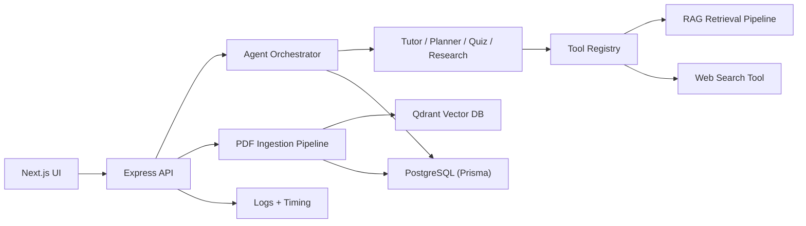

# ARCHITECTURE

## High-level system



## Request lifecycle (chat)

```text
Frontend /chat page
  -> POST /api/chat
  -> load/create conversation
  -> store user message
  -> retrieval pipeline (query embedding + vector search + rerank)
  -> orchestrator selects agent
  -> agent runs response tool loop
  -> tools execute (pdf retrieval, history, web, roadmap)
  -> assistant answer + traces returned
  -> assistant message + traces persisted
```

## Why this architecture exists

- Keep each AI concern inspectable for learning.
- Separate ingestion vs. retrieval vs. orchestration.
- Persist memory so personalization is visible in code and data.
- Return debug objects to frontend to reduce AI "black box" behavior.

## Main modules and responsibilities

- `backend/src/rag`: document pipeline and retrieval core
- `backend/src/agents`: role-specific agent behavior
- `backend/src/tools`: deterministic functions agents can call
- `backend/src/orchestration`: agent selection + execution coordination
- `backend/src/memory`: conversation history and learner profile
- `backend/src/observability`: request and timing logs
- `frontend/src/components`: UI panels mapping directly to backend flows

## Tradeoffs (intentional)

- Uses simple heuristic agent router for readability; can later upgrade to LLM-based routing.
- Uses lightweight reranking; can later add cross-encoder reranker.
- Optional Agents SDK mode; responses tool loop kept explicit for teaching tool-calling mechanics.
