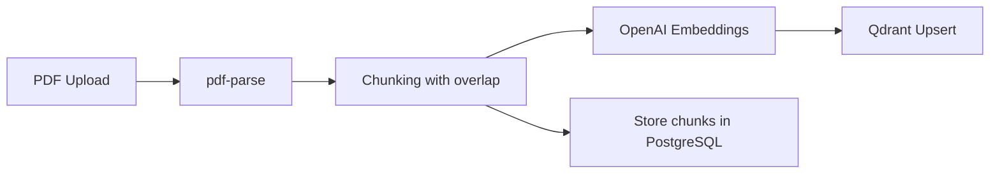
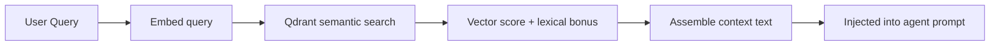

# RAG_FLOW

## Ingestion flow

## Retrieval flow

## Chunking strategy

- Paragraph-aware chunks with overlap.
- Defaults: `maxChars=900`, `overlapChars=120`.
- Why: keep chunks readable and context-preserving without heavy preprocessing.

## Embeddings

- Embedding model configured by `OPENAI_EMBED_MODEL`.
- Batched embedding requests for efficiency.
- Vector dimension discovered from first embedding response.

## Retrieval and reranking

- Primary signal: cosine similarity from Qdrant.
- Secondary signal: lexical overlap bonus.
- Combined score used to improve beginner-friendly relevance.

## Context assembly

- Top chunks are formatted with scores.
- Combined into one explicit context string.
- Context is injected into selected agent prompt.

## Educational note

This project keeps reranking simple to make reasoning visible. In production, you might replace this with a dedicated reranker model, metadata filters, and citation extraction.
